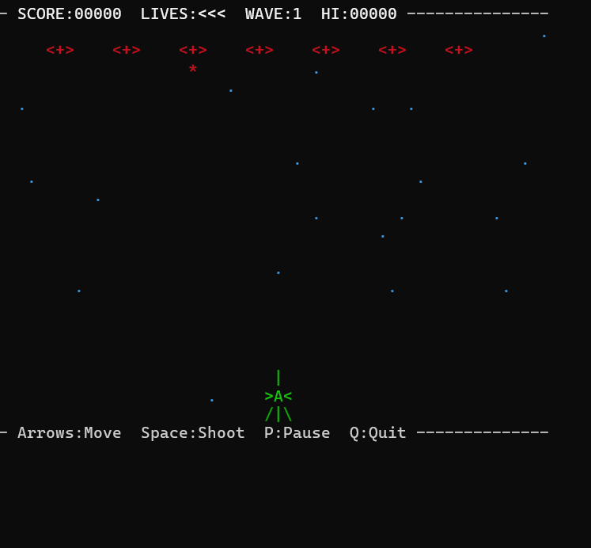

# Terminal Space Invaders

A simple, retro-style arcade game built directly in the terminal using Python's `curses` library. 



## Features
- **Wave-based Progression:** Enemies speed up and get harder as you progress.
- **Classic Gameplay:** Defend your ship, shoot down aliens, and survive as long as you can.
- **Starfield Background:** A scrolling starry background gives an authentic retro vibe.
- **Particle Explosions:** Satisfying text-based particle effects when enemies are destroyed.

## Requirements
- Python 3.x
- On Windows, you need the `windows-curses` package to play. You can install it via:
  ```bash
  pip install windows-curses
  ```
  *(Unix/Linux/macOS come with `curses` pre-installed.)*

## How to Play

Run the game from your terminal:
```bash
python main.py
```

### Controls
- **Arrow Keys**: Move your ship left, right, up, and down.
- **Spacebar**: Shoot your blasters.
- **P**: Pause / Unpause the game.
- **Q**: Quit the game.
- **R**: Restart the game after Game Over.

## Screenshots
(Add any more gameplay screenshots here if you like!)
